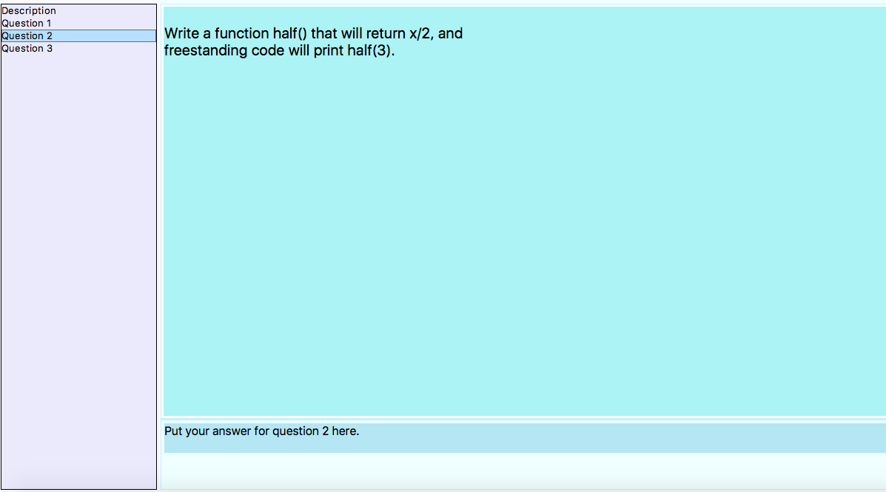

# OMSI: Online Measurement of Student Insight 

## Original development by:

<blockquote>

[Kiran Bhadury](mailto:kbhadury@ucdavis.edu),
[Vishal Chakraborty](mailto:vch@ucdavis.edu),
[Francois Demoullin](mailto:f.demoullin@gmail.com),
[Norm Matloff](mailto:matloff@cs.ucdavis.edu),
[Monte Misa](mailto:montemisa@gmail.com), 
[Rylan Schaeffer](mailto:ryschaeffer@ucdavis.edu),
[Tiffany Ching L Yuen](mailto:tyuen@ucdavis.edu)

</blockquote>

## Later contributors:

<blockquote>

[Arnav Acharyya](mailto:aacharyya@ucdavis.edu),
[Matt Donnelly](mailto:brilliantrocketscientist@outlook.com),
[S. Ismail](mailto:sismail@ucdavis.edu), 
[Lan Jiang](mailto:lanjiang@ucdavis.edu),
[Sachin Kumawat](mailto:skumawat@ucdavis.edu),  
[Thong Le](mailto:thmle@ucdavis.edu), 
[Chase Maguire](mailto:cmaguire@ucdavis.edu), 
[Darya Semyonova](mailto:dsemyonova@ucdavis.edu), 
[Sana Vaziri](mailto:vaziri@ucdavis.edu)

</blockquote>

## Maintainer (and author of this document):

<a href="http://heather.cs.ucdavis.edu/matloff.html">
Norm Matloff 
 </a> 

## Table of contents:

<UL>

<li> 
<a href="#quickstart">5-Minute Quick start for students and instructors:</a> 
</li> </p> 

<li> 
<a href="#what">What is OMSI?</a> 
</li> </p> 

<li> 
<a href="#benstudent">Benefits for students</a> 
</li> </p> 

<li> 
<a href="#benteacher">Benefits for instructors</a> 
</li> </p> 

<li> 
<a href="#howuse">How to use this package</a> 
</li> </p> 

<li> 
<a href="#grading">Software tools for grading</a> 
</li> </p> 

<li> 
<a href="#future">Future enhancements</a> 
</li> </p> 

</UL>


<h2>
<a name="quickstart"> 5-Minute Quick start for students and instructors:</a> 
</h2>

(In addition to the quick steps below, there is a fully worked-out
example for an exam using the R language in [a README file included in
this package](READMEecs132.md).  You need not know R to follow the
example.)

You'll need Python 3.0 or higher on your machine.

Here you will start the server (normally done by the instructor); 
start the client (normally done by the student); play the role of the
student, working a quick exam problem and submitting it to
the server; and play the role of the instructor, inspecting the student's
submitted work.

- If you know **git**, just clone [the OMSI repo](http://github.com/matloff/omsi).  Otherwise, go to the repor and download the
  **.zip** file (**Clone or download | Download ZIP**), and unzip it, 

- In a terminal window, change to the resulting directory/folder 
  **omsi-master**. You should see files **OmsiServer.py** etc.  
Use this terminal window for the server.

- From the same directory/folder, open a second
  terminal window, this one for the client.

- In the first window, start the server, say at port 2000 and exam name 'abc':

``` 
$ python OmsiServer.py 2000 abc
```

- In the second window, start the client, say with student ID me@xyz.edu
  and exam code 88 (ID and code fake for this dry run):

``` 
$ python OmsiGui.py localhost 2000 me@xyz.edu 88
```

- In the client GUI that comes up, choose **File | Connect**.  Click
  **Enter** in the dialog box that pops up.

- In the GUI, you'll now see a sample exam that comes with
  the package. Choose some question that asks you to write code.

- You'll see the question in the upper-right box.
  Type the answer in the lower-right box.

- Choose **File | Save** and **File | Submit & Run**.  A dialog box will
  pop up, reporting that the file was successfully submitted to the
server, and the code will be run in another dialog box, showing the
output.

- Exit the client, **File | Exit**.  To see that your submitted answers
  (note plural) are indeed there at the server, enter the directory/folder
**InstructorDirectory/abc/me@xyx.edu**, and observe that there it is, in
the file **omsi_answer2.py** or whatever.

- Kill the server by hitting ctrl-C.

Note that since you had the host and client on the same machine, the
host was 'localhost'.  On a real exam, the instructor announces the
location of the server, and the students use that instead of
'localhost'.

<b>IMPORTANT NOTE:</b> The students may need a VPN to access the server.
If so, they must keep this in mind when starting up OMSI. 

<h2>
<a name="what"> What is OMSI?</a> 
</h2>

OMSI, short for Online Measurement of Student Insight, is a software
tool for conducting and grading examinations in a manner that is both
secure and conducive to **high-quality measurement of student insight**.
It is suitable for small or large class exams, be they based on
**essays, writing code or math analysis.**  This is NOT a "Scantron
multiple choice test administration tool."

Students come to the classroom at the regular class time, just as with a
traditional pencil-and-paper exam.  However, they use their laptop
computers to take the exam, using OMSI.  The latter downloads the exam
questions, and enables the students to upload their answers.  Most
importantly, use of the laptop enables the student to actually do
his/her exam work on the laptop.

As detailed below, this arrangement has significant benefits for both
students and instructors.  The system is easy to install and use, and
can be run on Macs, Windows and Linux.

<h3>
Special benefit in programming courses:
</h3>

In the case of exams in programming classes, OMSI is
especially valuable:

<blockquote>

OMSI enables the students to **compile/run their code**, thus giving
them an opportunity to discover and fix errors.  I often give them the
intended output, for instance, and if their code doesn't match it, this
feedback allows them to think about where they went wrong (whether a
logic error or lack of understanding of the concepts in a math problem).
This thus gives them a chance to give the problem more thought and hopefully
correct their code.

</blockquote>

<h3>
Special benefit in math/statistics courses:
</h3>

<blockquote>

Note that even in math courses, the programming feature facilitates 
giving exams online.  Instead of being limited to multiple choice, the
exam can have the student present the answer as program code, e.g. in R,

<pre>
3*x^2
</pre>

for 3x<sup>2</sup>.  OMSI also allows display of graphics in R. 

</blockquote>

<h3>Sample screen:</h3>

Below is a screenshot of an example screen from the student's point of
view.

  

The details will be presented below, but even now the basic layout is
clear:  In the left panel, the student chooses which exam question to
work on; the question itself is shown in the upper-right panel; and the
student writes the solution in the lower-right panel, whether it be
code, math or essay.

<h2>
<a name="benstudent"> 
Benefits for students
</a> 
</h2>

Dear students:

OMSI will often result in __your getting a higher grade__ in an exam than
you would have in the traditional pencil-and-paper format:

1. With essay questions, you have a chance to edit your answers,
producing more **coherent, readable prose**.  No cross-outs, arrows, words
squeezed in above a line, no points off for unreadable handwriting. :-)

2. With coding questions, you will compile/run your code using OMSI,
**giving you a chance to make corrections** if your code doesn't work.


In both of these aspects, OMSI gives you a better opportunity to
demonstrate your insight into the course material -- and thus achieve a
better grade -- compared to the traditional exam format.

<h2>
<a name="benteacher"> 
Benefits for instructors
</a> 
</h2>

Dear instructors:

<b>
OMSI will make your life easier. :-) 
</b>

OMSI facilitates exam administration and grading.  It 
has two components:

<UL>

<li> <i>Exam administration:</i>  
</p>

OMSI manages the actual process of the students taking the exam.  

You get electronic copies of the students' exams, eliminating 
the need for collecting and carrying around a large
number of papers, and making work sharing much easier among multiple 
graders. 
</p>

At the end of an exam period, there is no chaos, e.g. from
students who are still writing even when the period is over; the
instructor merely shuts down the server at that time, and nothing
further can be submitted.  
</p>

If a student wishes his/her performance on an exam problem to be
reassessed, the fact that the files are online means that the instructor
can check the student's work from anywhere, rather than having to wait
for the next visit to the office.
</p>

As noted in "Benefits for students" above, OMSI enables the
student to turn in a better product, and this benefits the instructor as
well:  **Better exam performance by students is both more gratifying to
the instructor and also makes for easier, less frustrating grading**.
</li> </p>

<li> *Exam grading:* OMSI does NOT take the place of instructor
judgment in assigning points to exam problems. 
But it does make things much easier, by automating
much of the drudgery. For instance, OMSI automatically records grades
assigned by the instructor, and automatically notifies students of their
grades via e-mail.  Gone are the days in which the instructor must
alphabetize the papers, enter the grades by hand, carry an armload (or
boxload) of papers to give back to students in class, retaining the
stragglers not picked up by the students, and so on.

</UL>


<h2>
<a name="howuse"> 
How to use this package
</a> 
</h2>

Contents:

<UL>

<li> <a href="#term">Terminology</a> 
</li> </p>

<li> <a href="#install">Installation (instructors and students)</a> 
</li> </p>

<li> <a href="#students">Directions for students</a> 
</li> </p>

<li> <a href="#instructors">Directions for instructors</a> 
</li> </p>

</UL>

<h3>
<a name="term">Terminology</a>
</h3>

The Linux term *directory* is synonymous with *folder* for Mac and
Windows.

The Mac/Linux term *terminal window* is synonymous with *Command
Prompt* for  Windows (**cmd** command).

<h3>
<a name="install">Installing the package (instructors and students)</a>
</h3>

You will need Python 3.0 or higher installed on your machine. For Mac
and Linux systems, it may already be there, but it is easily
downloadable for Windows.

You must have Python in your executable search path.  To check this,
open a terminal window and type

```
python
```

in a terminal window.  Python should start, displaying the >>> prompt.
(Exit via ctrl-d or by typing 'exit()'.)  If you have both Python 2.7 and
3 on your system, you will need your login file, e.g. **.profile** for
**bash** to give priority to version 3.  Note: OMSI, which runs in
Python, will itself invoke Python.  Thus Python 3 must come first in the
search path.

In the case of exams involving coding, the same statements above about
search path and so on apply to compilers (e.g. **gcc**) and other
interpreters.  For example, if your exams will be using R, 
open a terminal window and type

```
R
```

in a terminal window. (Start R directly in this manner, not from RStudio
or the R screen icon.) R should start, displaying the > prompt.  Exit
via ctrl-d or by typing 'exit()'.

**Make absolutely sure Python and R can be run from the command line as
above.**

To install OMSI, download the <b>.zip</b> file from [the OMSI
site](https://github.com/matloff/omsi).  Unzipping it will produce a
directory/folder <b>omsi-master</b>, where all relevant files reside.
We'll call this the <i>OMSI Home</i>.

<h3>
<a name="students">Directions for students</a>
</h3>

<b><i>Connect to the server, at the start of the exam:</i></b>

Assuming you  installed the package earlier, open a terminal window,
change to the OMSI Home, and run

```
python OmsiGui.py
```


Then connect to the server and get the exam questions by selecting
<b>File | Connect</b>.  State the host, port and exam code provided by
the instructor, and   your student e-mail address.  (You can also type
them as command-line arguments; see below.)

After you connect to the server, the exam questions will be downloaded
to your machine.

<b>NOTE:</b> There should be two separate windows on the right of the
GUI, one on top for the question prompt and one below to write the
answer. The boxes are resizable and the question box may default to
occupying most or all of the right side of the screen on some systems.
If this is the case grab and drag up the bottom of the question box to
expand the bottom window.  The boundary between the question and answer
boxes may actually be hidden by your OS toolbar at the bottom of your
screen; if so, resize the entire window first, then drag it upward so
that the boundary line is visible.

You have the option of specifying needed information on the command line
instead of later into the GUI.  For instance:

```
python OmsiGui.py xyx.edu 2000 me@abc.com Midterm1 
```

(You need not specify all of these on the command line, but the ones you
do specify must be in order, nothing skipped.)

In addition, if your instructor allows it, you may specify a PDF file of
material to help you.  See below.


<b><i>Copy-and-paste:</i></b>

In programming classes, the instructor may wish to place a template,
i.e. an outline of the answer, in the question box, with students filling in
the gaps in the code.  Copy-and-paste operations using a mouse may
depend on the type of machine/OS used.  Instead, OMSI offers a
**CopyQtoA** selection in the menu, which completely copies the contents
of the question box to the end of the answer box.  Students then edit.
(You may need to scroll down in the answers box to see the copied
material)

<b><i>Saving answers:</i></b>

Click the question number on the left of the OMSI screen, and select
<b>File | Save</b>.  Note that **saving is NOT submitting to the
server.** Saving your file does NOT upload your answer to the
instructor's server; the save operation merely saves to a file on your
local machine.  See "Submitting your answers" below for uploading to the
instructor.  Note too that **Save** saves your answer to the current
problem, not all of the problems.

By the way, your answer files are saved locally in your OMSI Home
directory, i.e.  the same directory from which you launched OMSI, with
file names beginning with 'omsi_answer', e.g.  __omsi_answer2.txt__.
This can be useful if you want to check later what you submitted.  

<b><i>Compiling/running code:</i></b>

Save the code first.  Then, if the problem involves a compiled language
such as C, select <b>File | Compile</b>. A new window will pop up,
confirming that your submission was received at the server, and then
(possibly after a short delay) another window will pop up to
display the results.  Then select <b>File | Submit & Run</b> (or for
an interpreted language like R or Python, go to this step directly, no
compile step). A new window will pop up, displaying the results.

OMSI has the capability of displaying R graphics.  See below.

<b><i>Submitting answers:</i></b>

Submit the **answer to a particular question** by clicking on the question
number on the left side of the OMSI screen, and selecting <b>File |
Submit</b>. This will upload your answer to the instructor.  A dialog
box specifying whether submission was successful will then be displayed.

Note again that clicking the **Submit** only submits your answer to the
problem you are currently working on, **not all the problems**.

**IMPORTANT:**  There may be a delay of a few seconds before the submit
operation completes and the confirmation box comes up.  Do not perform
any OMSI operations while waiting for this.

Note:

1. Each time you run your code, it is automatically submitted to the
   server.

2. Each time you submit your solution to a question, the new solution
overwrites the old one, both locally and on the server.

<b><i>Viewing a PDF file for consultation:</i></b>

The instructor may allow you to consult a PDF file to help you during
the exam.  In my case, for instance, my exams are open-book, and the
book is in the form of an open-source PDF file, so this OMSI option
makes the book available to my students during exams.  Or your
instructor may provide you with a PDF "cheatsheet," say containing
important formulas.

To view the PDF file, select <strong>File | View PDF</strong>.  Note
that in order to use this option you must specify so in the command line
when launching OMSI, e.g.

```
python OmsiGui.py xyx.edu 2000 me@abc.com exam2 "open abc.pdf"
```

for a consultation file **abc.pdf**.
Depending on your OS, you might have a different command to open the PDF
file than **open**, e.g. **evince** on a Linux system.

<b><i>Viewing an R or Python help file:</i></b>

Depending on your OS, you may be able to view help files from within
OMSI.

For instance, say you are using R in an OMSI exam question, and have
forgotten how to use R's **rbind()** function.  Simply place

``` r
help(rbind,help_type='text')
```

in your answer window, and hit Submit & Run!  For some OSs, you may need
to try <b>type='pdf'</b> or <b>type='html'</b>.  Of course, you should
determine the proper argument for your system *before* you take your
first exam.

Also, in R a line like

``` r
args(rbind)
```

should work independent of your OS, to do a quick check of the required
arguments for a function.

<b><i>Viewing output of R graphics:</i></b>

If, say, you call **hist()** to form and display a histogram, R will
write the output to a file **Rplots.pdf**, since it does not know of a
screen to display on.  You can view the plot by clicking
<strong>File | View R graphs</strong>, provided you specified a PDF
viewer when you launched the OMSI client (see above).

# Tips for students

Properly used, you will find that OMSI provides the instructor with a
more accurate assessment of your insight into the course material, i.e.
you get a better grade.  But you do have to keep in mind the following.

- <i>Make SURE you are prepared:</i>
**Be sure to try OMSI in an actual session before your first OMSI-based
exam.**  Start up the server, playing the role of the instructor (see
"Directions for instructors" below), and then start the client, playing
the role of the student as above.  (Note:  If you run the server on your
local machine, specify the server location as 'localhost'.)

- Make sure your laptop can connect to your school's WiFi system.

- Make sure your laptop is fully charged before the exam.  

- It is good to remove your old answer files (their names begin with
"omsi_answer") from a previous exam before starting the current one.

- In programming classes, make absolutely sure that your software is
configured properly.  For instance, with R, make sure that typing 'R' in
a terminal window does start R.

- *Starting OMSI:* Make sure you launch OMSI from your OMSI Home directory.

- *Submitting your answers:* Submit your answers often. Near the end of
  an exam period, the network may be very busy, possibly making it
difficult to get in.  Note that each submission will overwrite the last. 

- Remember that saving an answer does NOT submit it.  You must do
that separately.

- *Following your instructor's directions:*
When you begin the exam, your very first action should be to click
**CLICK HERE FIRST**.  The instructor may have directions there that will
make a night-and-day difference in your grade!  So first take a few
seconds to read this.  

*Tips for programming classes:*

- If your exam tests you on Python or R, remember that they won't be
running in interactive mode here, so you must write explicit **print**
operations.  Graphical displays will not work, for the same reason.
(See the R workaround, above.)  Note too that
these are not compiled languages, so you should not hit the **Compile**
button.

- If you have a runtime error, the output of your print statements may not
be displayed. You can remedy this by placing a *return* statement or
similar before the line of the runtime error.

*Other tips:*

- If your instructor allows you to use OMSI's PDF viewing option, use a
PDF viewer that has a good search facility, so that you can quickly find
what you need during an exam.

<h2>
<a name="instructors">Directions for instructors</a>
</h2>

<h3>
InstructorDirectory
</h3>

Within the OMSI Home directory, there will be a subdirectory named
**InstructorDirectory**. You place your exam questions in that
directory, in a file **Questions.txt**.  The format for specifying the
questions is detailed below. 

*The Questions.txt file:*

Upon startup of the server, a subdirectory of **InstructorDirectory** will be
created for this exam, and within it there will be a further
subdirectory for each student, using the e-mail address provided by the
student.  In a student's subdirectory there will be an answer file for
each question. e.g.  <b>omsi_answer1.txt</b> or <b>omsi_answer2.java</b>


*Known issues:*

As of the current version, the server may have trouble with
downloading very long files on some networks.  It is best to keep the 
**Questions.txt** file to under 3000 bytes.  The same is true for
**SuppFile**, etc.

<h3>
Starting the server
</h3>

I usually run the server on a machine in our student computer lab, using
**ssh** to remote login to the lab computer.  (It can also be run on the
instructor's laptop computer, providing the latter is configured to be a
server.  See "Tips" below.)

At the start of the exam period (not before), start the server from a
terminal window by issuing the command

```
python OmsiServer.py portNumber examName examCode
```

from within the OMSI Home directory, e.g.

```
python OmsiServer.py 5000 Midterm1 breadbox
```

The port number must be at least 1024.

This will create a directory **Midterm1**, in which the students'
submitted answers will be stored.

The server Internet address, port number and exam code (no embedded
spaces) will need to be announced to the students at the start of the
exam. 

<h3>
Closing the server
</h3>

At present, this is simply done via ctrl-C.

<h3>Providing the exam questions</h3>

Before the exam, the exam questions must be placed in a file called
**Questions.txt** in the <strong>InstructorDirectory</strong>. The file
should contain a description and the questions for the exam. If there
are notes the instructor would like to write to him/herself in the file
they can be placed at the beginning, in the section labeled **NEW**.  

When parsing the file, OMSI will go through line by line and search for
keywords **NEW**, **DESCRIPTION** or **QUESTION**.  The roles are as follows:

  * **NEW**:  Optional. The lines that follow will  contain private 
  notes for the instructor.  
  * **DESCRIPTION**:  Required. The lines that follow will contain instructions 
    to students, which would normally go on the front page of a 
    printed exam, say "You will have 50 minutes for this exam."
 .  The students will be able to view it by clicking the **CLICK HERE FIRST** 
    button in the menu.  
  * **QUESTION**:  Have one of these lines for each exam problem.  For 
  problems involving code, directions for compiling or running the 
  code go on this same line.  The lines that follow this line contain 
  the question, to be viewed by the students.

Example **Questions.txt** file:

```
DESCRIPTION

You will have 50 minutes for this exam.

QUESTION -ext .py -run "python omsi_answer1.py"

Write a Python function half() that will return x/2, and 
freestanding code will print half(3).

QUESTION 

What does 'D' stand for in "UCD"?

```

In this example, two exam questions are defined, one requiring Python
code and one requiring an essay.  When a student writes and submits the
answers, they will be saved in files **omsi_answer1.py** and
**omsi_answer2.txt** in <strong>InstructorDirectory</strong> at the
instructor's server, in the current exam directory, and
in that student's subdirectory (indexed by e-mail
address or other student ID).  

The suffix in that first file name arises from the specification **-ext
.py** in the QUESTION line; otherwise the default suffix is **.txt**,

The **-run** field tells OMSI how to run a student's code.  This will be
invoked when the student clicks **Submit & Run**, and later when the
exam is graded, if the instructor uses the OMSI grader.

<b><i>Specifying compile and run options</i></b>
 
There are various **QUESTION** line options for the case of compiled
code.  For instance, Question 1 might have a line

```
QUESTION -ext .c -com gcc -flags "-Wall -g" -run ./omsi_answer1
```

OMSI will compile the student's code using **gcc**, taking
**omsi_answer1.c** as input, and if the compilation is successful, it
will produce the executable file **omsi_answer1**.  The **-flags** field
is mandatory.  (Students running OMSI within a virtual machine may have
a problem with **-Wall**, so the instructor may wish not to use this
flag.)

Here is one for R, for a Question 3:

```
QUESTION -ext .R -run 'Rscript ./omsi_answer3.R'
```
Note that fields with embedded spaces must be quoted.

*Vital note:* Do not touch the same **Questions.txt** file with both a
Windows machine and a Mac. It is well-known that such mixing of
machines on the same file can cause corruption in the contents;
see [the details](README.macWindowsIssue).


# Tips for instructors

OMSI should greatly improve the examination process for both instructors
and students.  However, as with any automated system, some care is
needed to insure that things run smoothly.

## Making sure you know the procedures

In familiarizing yourself with OMSI, do a trial run, playing the role of
both instructor and student.  Start up the server as the instructor,
then take the exam as a student.  Look at the files that are then
produced at both the server and client ends.

<i>Making sure the students know the procedures:</i>

It is crucial that the instructor, before the first OMSI-based exam,
require the students to go through a dry run.  The instructor may wish
to incentivize this.  The instructor can nudge the laggards who haven't
gone through the dry run (as evidenced by the lack of submitted files
from them).

<i>Dealing with exam time constraints:</i>

If the exam involves coding, it's hard for a student to write full code
within an exam period.  What I like to do is give the students partial
code in the question, and have them fill in the missing lines, and/or
modify existing lines.  Clicking the **CopyQtoA** button will copy the
contents of the question window to the answer window, so students need
not type in the provided partial code.

<i>Exigencies:</i>

"Stuff happens."  What if, say, there is a sudden power failure or the
local WiFi access point suddenly goes out?  What if some students do not
go through the dry run, even with major incentives/disincentives, and
have trouble using OMSI in the first exam?  The following are worth
considering:

  * Paper copies of the exam prompt should be distributed at the start
    of the exam, and students should have the option of turning in their
    answers on paper.  Some students may not even have laptops (though
    it should be emphasized to students that they do NOT need a "fancy"
    laptop; an old and slow one is fine).

  * Students should be told to click the **Submit** option "early and
    often."  (Each submission will overwrite the last.)  This is
    especially important if there is concern that the local WiFi access
    point might be flooded with traffic at the end of the exam period,
    as many students turn in last-minute work.  

    There is currently a 20-second timeout setting for client
    transmissions to the server.  After that, the client will try again.
    Note that on Mac machines, the "spinning rainbow disk" will appear
    after a few seconds.  This should not cause alarm in the students;
    it will disappear when the client is finally able to contact the
    server.  If desired, though, the student can kill the OMSI client
    and restart it; the previously-saved answers will still be there.

    The instructor may also consider running two (or more) servers, in
    order to improve response time.

  * Students should bring a USB key (thumb drive, memory stick).  In an
    emergency, they can copy their local copies of their **omsi_answer***
    files to the key, then turn in the key.

<i>Where to run the server:</i>

I usually run the server on a machine in our student computer lab,
which gives me a static IP address. I use **ssh** to remotely log in to
the server from the classroom, and start the server at the appropriate
time.  Depending on configuration, **ssh** may time out after a certain
time, so I run **screen** and run the server within a terminal window
there (Sachin's idea).  I also run **script** at the server, to get a
full record of all transactions, possibly of great use if there is
suspicion of cheating.

In other words, I issue commands like this example:

```
ssh pc22.cs.ucdavis.edu
cd omsi.home  # wherever OMSI Home is
screen
script Midterm1
python OmsiServer.py 2000 Midterm1
ctrl-a, ctrl-d  # exit 'screen'
exit  # leaving pc22
ssh pc22.cs.ucdavis.edu  # preparing to shut down server, end of exam
screen -r  # resume 'screen' (but server has been running all along)
ctrl-c  # kill server
exit  # end 'script', have record now in Midterm1 file
exit  # end 'screen'
exit  # leave pc22
```

*Running the server on a laptop:*

For experts only!

The instructor could run the server on a laptop computer in the
classroom.  However, this gives a dynamic IP address, basically
visible only to other machines using the same router.  The students'
laptops must thus also go through the same router.  This should be fine
as long as the instructor and students are both using the university's
WiFi access, but it must be carefully tested beforehand.  Note that this
approach may be more secure.  Obtain the server's IP address via the
**ifconfig** command for Mac or Linux, **ipconfig** for Windows.

<i>Cheating:</i>

What about cheating?  In my experience, the vast majority of students
are honest, and they resent the cheaters.  What can be done about the
latter?

  * The OMSI window is designed to fill the student's entire screen.
    This prevents a student from communicating with others electronically
    during the exam, say by e-mail.  The students must be given 
    strict instructions not to move, iconify or resize the OMSI window 
    during the exam.  This is easily monitored by proctors.

  * As usual with any type of exam, there is the problem of a student
    looking at his/her neighbor's work, in this case a laptop screen
rather than a piece of paper.  A common technique for dealing with this
in the paper exam case is to require students to sit in specific seats
that are randomly assigned to them, in order to prevent collaboration
among friends.  One can also have an exam question that requires each
student to state who her left and right neighbors are.  These measures
can be taken with OMSI as well.

  * If the server is run through a static IP address, it is conceivable
    that a dishonest student will take the exam at a location not in the
    classroom, thus enabling illicit "consultation" by hiring, say,
    dishonest graduate students for help.  Sign-in sheets, taking photos
    etc. can be used to avoid this.  Note that the server will record 
    the transactions by the students in the 'script' file in the exam 
    directory (if run as above).  Use of an exam code, especially a 
    longer one not easily guessable or easily sent surreptiously by 
    cell phone, is a major preventing remedy.  Needless to say, use of 
    cell phones during the exam should be strictly forbidden.

I have a [set of
groundrules](http://heather.cs.ucdavis.edu/OMSIrules.html) that
instructors may find useful.

<h2>
<a name="grading">Software tools for grading</a> 
</h2>

The answers submitted by the students and collected by the server may be
graded by hand as usual.  However, tools to facilitate electronic
grading are available in this package.  As noted earlier in this
document:

<blockquote>

OMSI does NOT take the place of instructor judgment in assigning points
to individual exam problems.  But it does make things much easier, by
automating much of the drudgery. For instance, OMSI automatically
records grades assigned by the instructor, and automatically notifies
students of their grades via e-mail.  Gone are the days in which the
instructor must alphabetize the papers, enter the grades by hand, carry
an armload (or boxload) of papers to give back to students in class,
retaining the stragglers not picked up by the students, and so on.

</blockquote>

The basic idea is that the grading software will display on the screen,
for each student and each exam problem, the student's answer.  In the
case of coding questions, the software will also run the code and
display the result.  In each case, the instructor then inputs the number
of points he/she wishes to assign.  In summary, OMSI runs

```
for each student:
   for each exam problem:
      if problem involves coding:
         compile and/or run code according to the
            QUESTION line of Questions.txt, displaying result
      display student answer
      instructor inputs number of points 
   record grade for this student (individual problems and total)
```

The main tool is **Grading/AutoGradeOMSI.R**.  This code is in R, as it
is an adaptation from an earlier system I had developed. Also, R's
statistical and graphic capabilities facilitate analysis of the exam
grades.  (There is also a file **AutoGrade.py** in that directory, but
it is under development.)

Detailed directions are given in the comments at the top of the file.

<h2>
<a name="future">Future enhancements</a> 
</h2>

Much improvement is possible.  **Contributors of new code are welcome!**

Here are some points of improvement:

  * Tablet-friendly version of OMSI.

  * Authentication code to check a student's e-mail address against a
    class list upon connection, with passwords being required.  
  
  * Code to confirm the integrity of the OMSI client code (i.e. verify
    that the source code hasn't been changed), and to upload each
student Submit & Run operation to the server, to guard against the
student running surreptitious communication code.


<h2>
<a name="future">No warranties of any kind are given for this software</a> 
</h2>

