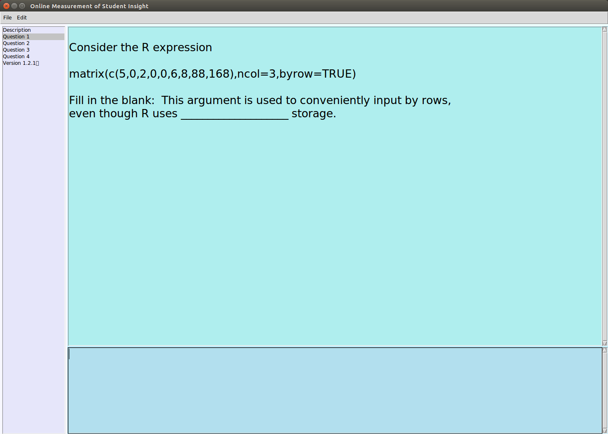
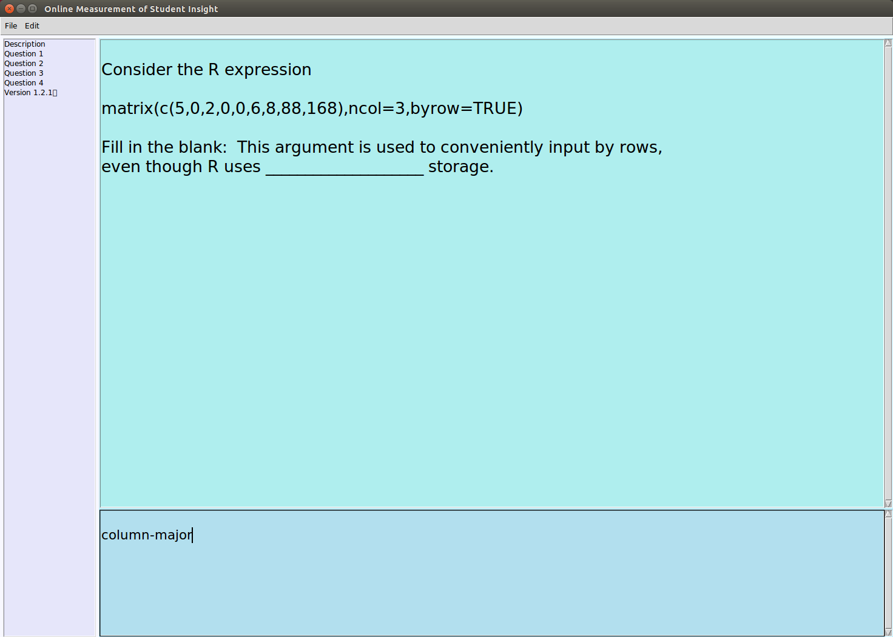
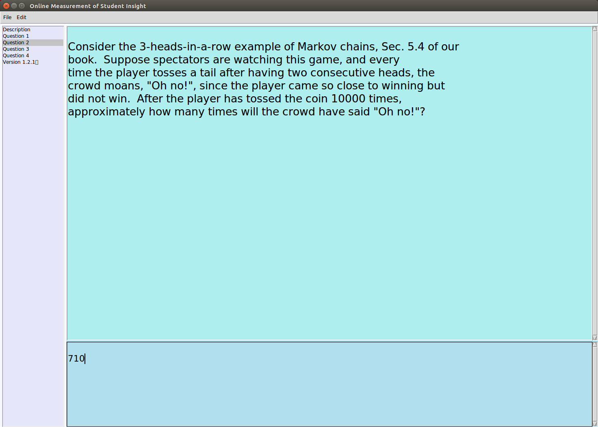
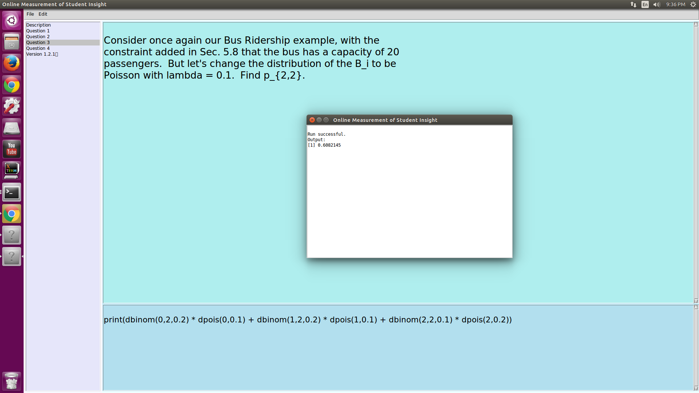
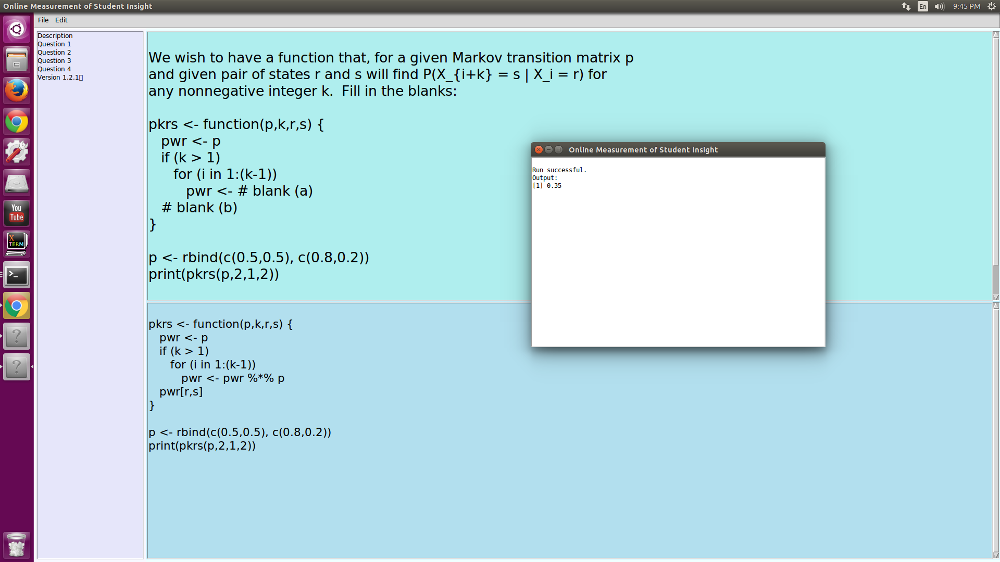

# OMSI: Online Measurement of Student Insight 

## Example: Real exam problems from ECS 132, UC Davis

After connecting to the server and selecting Question 1, the student
will see this OMSI screen:

The bottom area is for the student's answer.  The student fills it in:

The student must also remember to click Save and Submit.

The student then moves on to Question 2, and answers:

Now, on to Question 3:

Question 3 asked for executable R code.  The student filled in the
answer, then hit Save and hit Run.  The latter action brought up the
pop-up run window, with the result of the run.

Finally, the student tackled Question 5, filling in the blanks in the
code, saving and running:

The student made sure that all her answers had been submitted (each
submission for a problem overwrites the last), exited OMSI, and went
home happy. :-)

